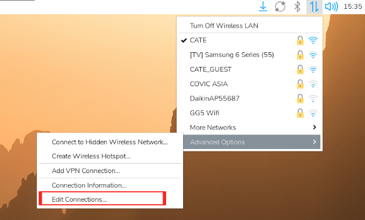
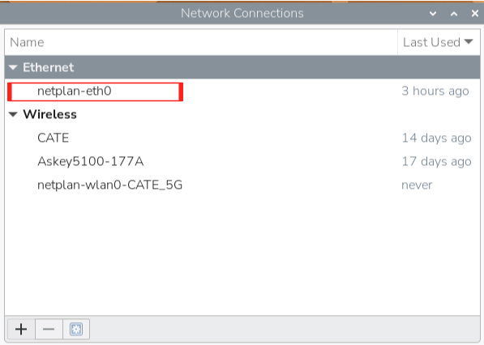
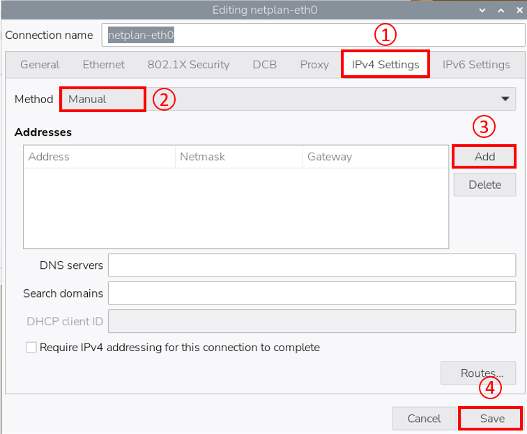

# AES PA system
---

## Setting Up

What you need:
- Raspberry Pi Model 3B
- 32GB microSD card
- Raspberry Pi Power Supply
- Monitor Screen
- HDMI Cable
- Keyboard and Mouse (USB-A)

### Raspberry Pi Imager
Install [Raspberry Pi Imager](https://www.raspberrypi.com/software/) if you have not done so.

### VNC Viewer
Install [VNC Viewer](https://www.realvnc.com/en/connect/download/viewer/?lai_sr=5-9&lai_sl=l) if you have not done so.

### Flashing OS into Raspberry Pi Board
1. Insert the microSD card into your computer and launch **rpi-imager.exe**.
2. Under **Device**, select the correct Raspberry Pi Model (**Raspberry Pi 3**).
3. Under **OS**, select **Raspberry Pi OS (64-bit)**.
4. Under **Storage**, select the microSD card.


#### Customisation
1. Under **Hostname**, name the Pi in accordance to this format: cate-PA-{*Station Name Abbreviation*}.
    >Example: For Fire Station 1, hostname will be **cate-PA-FS1**
2. Under **Localisation**, ensure settings are as follows:
   1. Capital City: **Singapore**
   2. Time Zone: **Asia/Singapore**
   3. Keyboard Layout: **us**
3.  Under **User**, username and password should align with CATE's standard.
4.  Under **Wi-Fi**, enter the SSID and credentials for the network you are currently in.
    > NOTE: Ensure you have stable internet connection.
5. Under **Remote Access**, select **enable SSH** and choose **use password authentication** as the *Authentication Mechanism*.
6. Under **Raspberry Pi Connect**, do not enable this feature.

Upon completing all of the steps above, select **Write** to start flashing the OS into the microSD card. This process will take a while (~10 min).

### Power On
---

Insert the microSD card into the Raspberry Pi and connect the power supply. There are 2 LED indicators on the Raspberry Pi (beside power supply port).
> Solid Green: Raspberry Pi is booting up

> Slow Flashing Green: Raspberry Pi is running

1. Connect the monitor, keyboard and mouse to the Raspberry Pi.
2. Once the Desktop is shown on the monitor, check for Wi-Fi connection (top right corner).
> NOTE: Connect to Wi-Fi if not connected

### Script Downloading
---
Before proceeding to the next step, ensure Wi-Fi is connected.

Open terminal (top left corner) and run these commands:
```
git clone https://github.com/roydenlyr/cate-PA.git
cd cate-PA/scripts
chmod +x setup.sh
./setup.sh
```
``setup.sh`` is a shell script that will install all relevant resources required for the system to run. This process will take a while (~5 min).

> NOTE: The command *sudo* is used in ``setup.sh`` and gives user elevated privilege. Terminal may prompt you for the password. This is the password you have configured under [CUSTOMISATION (point 3)](#customisation).

Once the script has completed running, you should see this message displayed in the terminal:
```
Remaining manual steps (on deployment ground):
    1. Copy SSH key to FS1:    ssh-copy-id cate@{FS1 IP Address}
    2. Verify stations.json is correct on FS1
    3. Start service:          sudo systemctl start pa-audio
        Or reboot:             sudo reboot
```

### Setting Static IP
---
After `setup.sh` completes, configure the static IP for the deployment network:

1. On the Desktop, **right-click** the network icon (top-right corner of the taskbar).
2. Select **Advanced Options** → **Edit Connections**.

3. Double click **netplan-eth0**.

4. Go to the **IPv4 Settings** tab.
5. Change **Method** from `Automatic (DHCP)` to **Manual**.
6. Under **Addresses**, click **Add** and enter:
   - **Address**: The station's IP
   - **Netmask**: The network netmask
   - **Gateway**: The network gateway
7. Click **Save** and close the window.


This will take effect when the LAN cable is plugged in onsite.

Setting up of Raspberry Pi is almost done. The remaining configurations will have to be carried out onsite after connecting to the local network.

### Station Configuration
---
The following steps will have to be performed onsite where the Raspberry Pi is connected to the local network.
> NOTE: Before continuing, ensure that the Raspberry Pi is powered on and the LAN cable has been plugged in.


1. Once the Raspberry Pi is within the network, SSH into the Raspberry Pi:
```
ssh cate@IP_ADDRESS
```
where ``IP_ADDRESS`` is the IP address of the Raspberry Pi. You will be prompted to enter the password.

Once you have successfully SSH, run this command:
```
ssh-copy-id cate@128.127.1.50
```
2. Using [VNC software](#vnc-viewer), access **FS1**.
   1. Open Terminal through VNC and run this command:

```
ssh-copy-id cate@IP_ADDRESS
```
where ``IP_ADDRESS`` is the IP address of the Raspberry Pi you have configured. Once completed, you can close the terminal but keep VNC open.

3. While still in VNC:
   1. From Desktop, open **Files** (top left corner)
   2. Open **cate-PA &rarr; src &rarr; ``stations.json``**

``stations.json`` provides a list of IP address of all stations in the format:
```
{
    "{STATION_ID}": "{IP ADDRESS}",
    "{STATION_ID}": "{IP ADDRESS}",
    "{STATION_ID}": "{IP ADDRESS}"
}
```

Update the list in ``stations.json`` to include the newly configured Raspberry Pi.

``STATION_ID`` should follow the same abbreviation given in [hostname](#customisation).
> EXAMPLE: Given the hostname cate-PA-FS1, STATION_ID = FS1. Do not include 'cate-PA-'.

> REMINDER: Always add the **comma ( , )** at the end of each line as shown in the list above **EXCEPT** the last line.

> WARNING: Ensure there are no typo errors in the file.

Once completed, press ``CTRL + S`` to save the file and close the window.

### Reboot
The Raspberry Pi configuration and set up is now complete. Reboot **all stations except FS1** for changes to take effect.
> IMPORTANT: Notify all stations' watchroom before rebooting. Rebooting will temporarily disable the PA system. However, IVCS will still be operational.

To reboot, either SSH into FS1 **OR** using VNC and open Terminal and run this command: 
```
cd ~/cate-PA/scripts
./reboot_all.sh
```

This will remotely reboot all stations except FS1. 
> NOTE: Do **not** reboot FS1. FS1 is the reference point for all stations and does not need to be rebooted.

Once completed,  you should see the message ``all stations rebooted``.